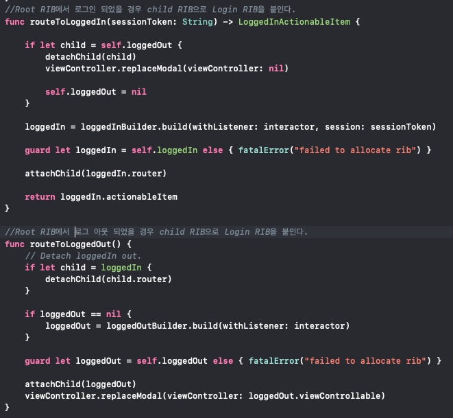

# 전문성(교육 - MVC, MVVM, ReactorKit을 거쳐 RIB정착기)

### 교육명
Let's swift2019 (MVC, MVVM, ReactorKit을 거쳐 RIB정착기)

### 교육 참석 동기
기존 유지보수했던 프로젝트는 MVC형태로 되어 있어 VIewController에 비즈니스 로직과 뷰에 관련된 코드가 작성돼있습니다.
그렇게 ViewController가 비대해진 경우 코드 유지보수에 용이하지 않았고, 새로운 로직을 넣는 작업도 쉽지 않았습니다. 개발과 유지보수에 용이한 좀 더 나은 아키텍처에 대한 궁금증을 갖고 있었고, 특히 ‘타다’앱이 Rib 아키텍처를 도입해 개발했다는 블로그를 보았기에 해당 섹션을 다른 섹션에 비해 관심을 갖고 컨퍼런스에 참여하였습니다.

### 교육내용
> RIBs 도입 이유
1. 프로젝트의 구조가 템플릿화 되어 있어 새롭게 조인하는 개발자가 소스 분석이 쉽다.
2. 확실한 안정화를 위한 테스트 코드 작성이 쉽다.
3. 화면 단위가 아닌 프로세스 단위(Viewless)한 아키텍처이다.

> RIBs의 구성 요소
1. Router: 
RIBs들을 어떻게 붙이고, 제거할것인지를 관리한다.
애니메이션에 관여.
2. Interator: 
RIBs의 가장 중요한 요소 비즈니스 로직(ex) API가 어떻게 호출되는지, 각 RIBs의 state를 어떻게 관리할지, 어떤 state로 변할지 등을 관리)을 관리한다.
어떤 Router를 붙이고 제거할것인지관리하는 Router의 Helper 역할을 한다.
3. Builder: 
팩토리패턴으로 Router와 Interator를 생성한다.
(A) RIB의 Router와 (B) RIB의 Interator를 이용해 새로운 RIBs로 만들수 있어 재사용성을 높여준다. 
4. View:
옵셔널한 존재로 유저의 Interaction을 담당하는 역할을 한다.
5. Presenter:
View가 존재할떄만 사용하는 요소로, Interator에서 나오는 데이터를 직접 뷰에서 사용할수 있도록 변형, View에서 받은 Interaction을 Interator에서 받을 수 있도록 변형해주는 역할을 한다.

> RIBs 아키텍처(프로토콜)

> RIBs 아키텍처 Flow

RIBs의 강점은 State관리에 있다. 하나의 어플리케이션에는 여러개의 State가 존재하고, 그 State를 트리화 할수 있다. 

Root RIB은 사용자가 로그인 상태인지, 로그아웃 상태인지를 판단하는 역할을 한다.

로그인이 되어 있다면 Main RIBs를 Root RIBs에 붙이고

로그아웃 상태라면 Logout RIBs를 Root RIBs에 붙인다. 

RIB간의 부모자식 관계, sibling 관계가 성립하게 된다.

MVC아키텍처의 경우 트리의 깊이가 얕아지게되고, 메인뷰에 자식 뷰컨트롤러가 많아져 메인에서 관리 해야할 컨트롤러가 많아지게 되어 관리가 어렵다.
비즈니스 로직에 의해서 state를 관리하고, 그에 따라 Scope를 가둬야 한다. 

> RIBs의 Scope

기존 아키텍처에서는 ojbect들이 VC에 묶여 있기 때문에 ojbect가 필요하지 않은 state에서 object가 살아 있을수 있고, object가 살아 있기 때문에 필요하지 않은 이벤트를 받기도 한다. 그렇기 때문에 nil체크를 해줘야 한다거나 force unwrapping을 해야 하는 코드가 필요하다.

root에 login이 붙으면(child ribs)에게 authtoken을 전달해줄수 있기때문에 login ribs에서는 authtoken의 값을 보장할수 있기 때문에 불필요한 nil체크를 하지 않아도 된다.

### 느낀점 
ViewController에 비즈니스 로직과 뷰(user interaction) 코드를 넣다 보니 massive viewcontroller가 되어 유지보수에 어려움이 많았었는데, 이 섹션을 수강하고 나니 적절한 아키텍처를 잘 적용한다면 각 요소 별로 역할을 분명히 나눠 개발, 테스트, 유지보수가 용이해 질수 있다는것을 다시 한번 느낄수 있었습니다. 하지만 이 섹션에서는 시간 관계상 이론적인 내용만 설명되어 아쉬움이 있었습니다. RIBs에 관한 섹션을 공부한 후 RIBs 아키텍처를 적용한 프로젝트를 github에서 찾을 수 있었고, 코드를 보니 컨퍼런스에서 이론적인 설명을 들은것이 명확하게 이해가되어 큰 도움을 받았습니다. 해당 프로젝트에서 RIBs에 중요 요소에 관한 코드를 첨부합니다.  

*Router

* Interactor

* Builder

# 리더십(Crash 조사 후 개선)

>  푸시 수신 후 Crash 발생하는 부분을 수정
#
기존에 (2.1.4~2.1.7 버전)푸시 수신 후 상세 페이지로 이동하는 함수가 재귀호출이 되는 경우가 발생하여 생긴 crash를 정상적으로 기능이 작동하도록 수정하였습니다.

